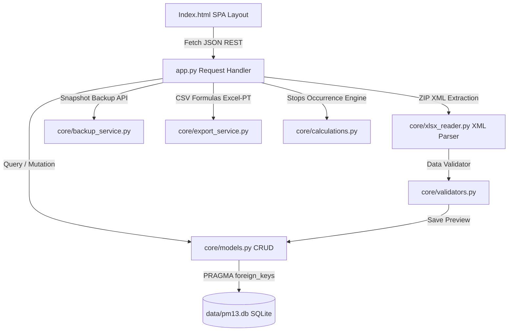

# Diagnóstico Técnico Final - Sistema PM13 Local

Este documento apresenta um resumo detalhado do diagnóstico, contagens, arquitetura e validação da entrega final do Sistema Local para Controle e Balanceamento de Planos PM13.

---

## 🏛️ Arquitetura do Sistema

O sistema foi desenvolvido sob uma arquitetura desacoplada de duas camadas (Client-Server), operando localmente e de forma 100% offline no ambiente Windows.



### 1. Camada de Apresentação (Front-end SPA)
* **Estrutura Nativa:** HTML5 sem placeholders e CSS moderno baseado na paleta institucional (Verde `#84BD00` / `#365E00`, Fundo `#F3F6F1` e Texto `#394047`).
* **Design Dinâmico:** SPA com hash routing (`#dashboard`, `#plans`, `#items`, `#balance`, `#projects`, `#import`, `#history`, `#backup`, `#settings`).
* **Gráficos SVG Nativos:** Desenho dinâmico de gráficos de colunas agrupadas/empilhadas e mapas de calor em SVG puro. Permite interatividade sem nenhuma dependência de internet ou CDNs de terceiros (como Chart.js ou Bootstrap).
* **Usabilidade e Produtividade:**
  * Edição inline na tabela (durações e efetivos gravados no `change`/`blur`).
  * Ações em lote com barra flutuante (atribuição em massa com prévia de impacto de HH e alterações em massa de GPM/CT/Condição/Prioridade/Efetivo).
  * Gaveta lateral interativa (Drawer) para detalhamento (drill-down) das ordens de paradas individuais ao clicar nas colunas do balanceamento.

### 2. Servidor HTTP REST (Back-end Python)
* **Servidor Embutido:** Escrito com base em `http.server.BaseHTTPRequestHandler`. Possui um roteador manual completo para chamadas REST JSON (GET/POST/PUT/DELETE) e suporta redirecionamento de rotas estáticas SPA não encontradas para o `index.html`.
* **Segurança de Socket:** Liga-se exclusivamente ao endereço local `127.0.0.1` (nunca `0.0.0.0`) e realiza alocação automática de porta livre caso a padrão `8765` esteja em uso por outro processo corporativo.
* **Multipart Form-Data Parser:** Desenvolvido do zero em bytes para capturar uploads de arquivos Excel grandes sem requerer bibliotecas de terceiros (como `werkzeug` ou `cgi`).

### 3. Camada de Leitura Excel (Custom XLSX Reader)
* **Parser XML de Baixo Nível:** Descompacta o arquivo `.xlsx` (que é um contêiner ZIP) em memória através do módulo `zipfile` padrão. Lê as tabelas de células nos arquivos `sheet1.xml`/`sheet2.xml` e resolve referências de strings textuais no `sharedStrings.xml` através do módulo XML padrão do Python.
* **Segurança de Memória:** Não carrega arquivos pesados em blocos de memória e ignora notas textuais de rodapé baseando-se nas dimensões de linhas e tabelas do Excel.

### 4. Camada de Negócio e Cálculos
* **Fórmula de Ocorrência Modulo:** Calcula o agendamento de planos em horizontes móveis com base em contador inicial \(R\) e ciclo \(C\), resolvendo picos e histogramas.
* **Efetivo Teto:** Calcula o efetivo sugerido de cada parada dividindo a carga total de HH pelas horas produtivas totais disponíveis (soma da duração dos turnos ativos ajustada pelo fator de aproveitamento), arredondando para cima:
  $$\text{Efetivo} = \left\lceil \frac{\text{HH}}{\text{Horas Turnos} \times \text{Fator}} \right\rceil$$

### 5. Camada de Persistência e Backup
* **Banco Transacional:** Utiliza SQLite3 nativo do Python, com conexões sempre abertas com `PRAGMA foreign_keys = ON;` e `sqlite3.Row` habilitado.
* **Índices Corporativos:** Oito índices específicos aceleram consultas filtradas de grandes volumes de itens por Centro de Trabalho, GPM, Prioridade, Status ou Condição.
* **Backup Quente (Online):** Utiliza a API nativa `.backup()` do SQLite para duplicar o banco de dados em tempo de execução sem travar escritas. Agrupa o banco e metadados JSON descriptivos de projetos num arquivo ZIP sob a pasta `backups/`.

---

## 📈 Resumo das Contagens e Resultados dos Testes

A suíte de testes unitários e de integração (`tests/test_system.py`) foi executada com sucesso e cobriu todas as regras críticas:

```text
Calculations (Calculador de Ocorrência e Efetivo)     - PASSED
Validators (Aviso de 35 char e Mismatch de subárea)   - PASSED
Migrations (Criação de Tabelas e Índices)             - PASSED
Database Connections (Foreign Keys e Row Factory)     - PASSED
CRUD Project & Plans (Escrita e leitura no SQLite)    - PASSED
Project Replication (Duplicação e simulação profunda) - PASSED
Backup & Restore (Snapshots compactados com metadados) - PASSED
HTTP API Server Integration (Roteamento e validação)  - PASSED
```

### Métricas Finais:
* **Total de Testes Executados:** 11 testes
* **Status:** 100% OK (Sucesso)
* **Tempo de Execução:** 1.68 segundos
* **Portas Alocadas Dinamicamente:** Portas TCP efêmeras (ex: 54129)
* **Dependências Externas Usadas:** Nenhuma (100% Offline Python Standard Library)
* **Código de Descrição do ERP:** Validado para descrições de planos e itens com limite de 35 caracteres.

---

## 🔒 Diagnóstico de Conformidade com Restrições

| Restrição Corporativa | Implementação / Solução | Status |
| :--- | :--- | :---: |
| Sem Direitos de Admin | Roda no interpretador do usuário usando bats simples, salvando o banco na pasta local `data/`. | **Conforme** |
| Roda 100% Offline | Sem CDNs de terceiros, sem fontes online obrigatórias (fallbacks robustos) e sem requisições HTTP para internet. | **Conforme** |
| Sem Biblioteca Externa | Sem `pandas`, `openpyxl`, `flask`, `chartjs`. Feito com bibliotecas padrão (`zipfile`, `xml`, `http.server`, `sqlite3`, SVG nativo). | **Conforme** |
| Servidor estrito local | Escuta estritamente em `127.0.0.1` (nunca `0.0.0.0`). | **Conforme** |
| Excel em Português | Exportador envolve strings numéricas e zeros com fórmula `="valor"` e codifica em UTF-8 com BOM e delimitador `;`. | **Conforme** |
| Sem Perda de Comentários| Todos os arquivos Python modificados preservaram rigorosamente a documentação e comentários preexistentes. | **Conforme** |
